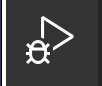
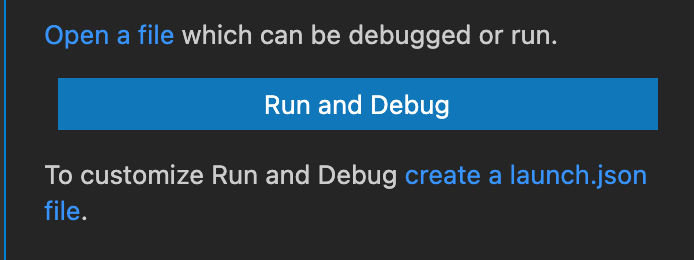
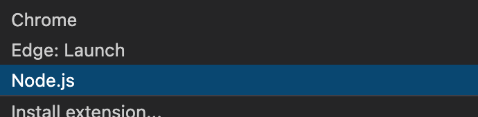
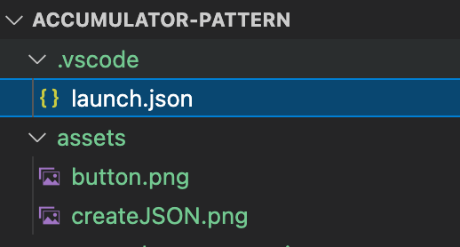
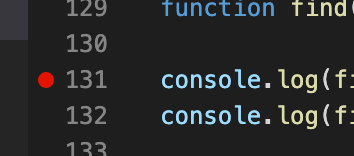
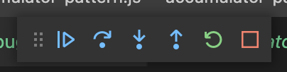
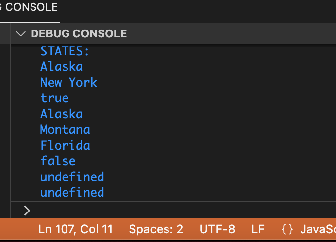

# VsCode Debugger


## Open your working directory in vscode

```bash
code .
```


## Create a launch.json file


  First - click the button on the left with the bug and triangle


   


  Click the link to create a new json file.


   
  
  You will be promted to select a configuration. 
  Select `Node.js`

   


After successfuly creating this file you should see a .vscode
directory with a lanuch.json file

 

## Run the debugger


  First select a breakpoint to stop at by clicking on a line in your code.


   


  Your code will stop on any break point you've selected and debug controlls will appear at the top of your window


  Additionally you will see a `debug console` on the bottom of your window.  

   

This console will allow you to engage with your code paused on the state it is in during its execution.  

 

You VSCode border color will change to `orange` while in a debuggin session.
That's how we use VSCode's built in debugger tools!


